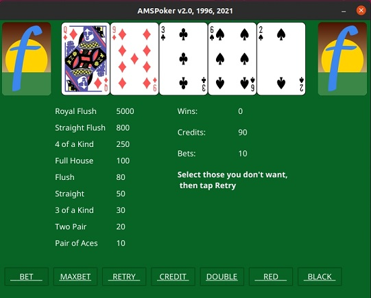

# AMSPoker v2

## Description

Poker Game written in Go/Fyne, based on the original I wrote in 1996 with Borland C++/OWL.



## Dependencies

* [Cross platform GUI in Go inspired by Material Design](https://github.com/fyne-io/fyne)

```
go get fyne.io/fyne/v2
```
(Ubuntu)
```
sudo apt install libgl1-mesa-dev xorg-dev
```

(CentOS)
```
sudo yum install mesa-libGL-devel.x86_64 libXxf86vm-devel libXi-devel.x86_64
```

## Build and run

```
go build -ldflags "-w -s"

./poker
```

## Author

* [Antonio Soares](https://github.com/ccie18473)

## License

This project is licensed under the [BSD 3-Clause] License - see the LICENSE.md file for details

